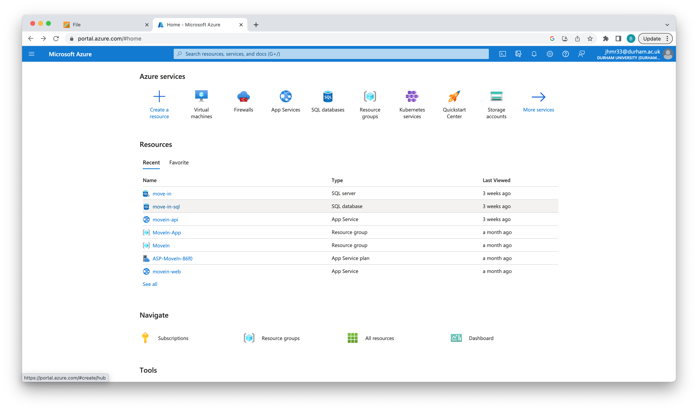
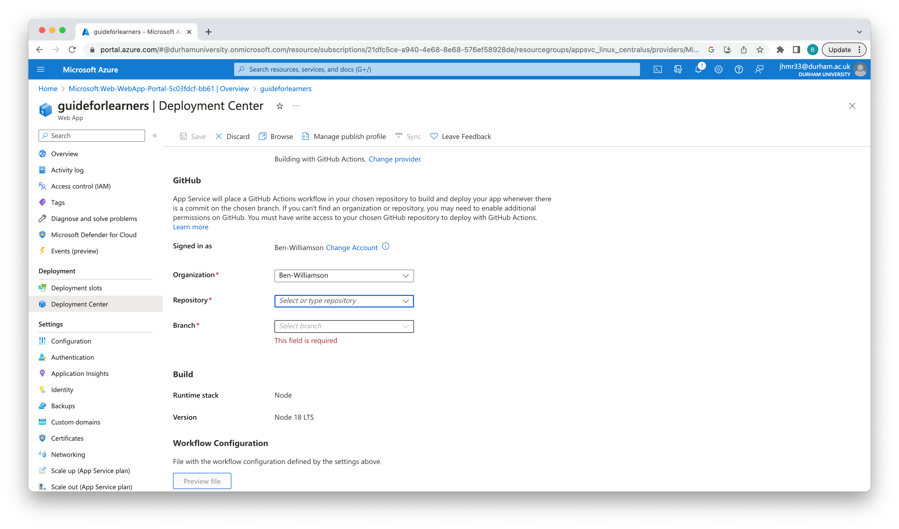
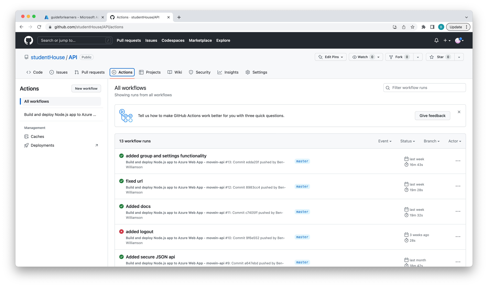

# Guide for Learners: WebApps on Azure


## Motivation: Why learn to use Azure?
### Why Cloud Host?
Cloud hosting has become the predominant method used to build new apps, rather than building out physical infrastructure at large upfront cost developers can now get started using inexpensive cloud infrastructure and scale up to larger servers when needed.


Cloud hosting also allows different locations to be targeted more easily than when using traditional infrastructure, if a developer wanted to reduce latency in a particular country they would be required to buy or lease real estate and build their own datacenter in that country.  This requires large amounts of funding and expertise, as well as taking a long time.  A Cloud Hosted App can be moved from datacenter to datacenter across the globe without any additional cost in a matter of minutes.


Cloud hosted apps are therefore more dynamic and less expensive to run than apps hosted on traditional infrastructure.


### Why Cloud Host using Azure?
Azure is Microsoft's offering in Cloud Hosting and is therefore backed by a large company which should ensure that it is supported long into the future.  This long term support should mean that these skills will not "go out of date", making the effort required to learn the platform worthwhile.


Azure also features competitive offers for students; they offer $100 to spend on Azure services and access to their free services while the credits last.


### Why learn to build Web Apps?
This project covers building a NodeJS web app and hosting it on Azure servers - this is an extremely versatile tech-stack which could be used to perform the following functions:


1. Hosting a static HTML website such that it is always accessible.
2. Hosting dynamic sites developed using frontend frameworks such as ReactJS or Vue.
3. Providing backend functionality to mobile and web apps.


This guide focuses on the third option as it provides the most wide ranging applications - by pairing a NodeJS server with an Azure SQL Database server complex and multifunctional APIs can be designed and deployed to support a multitude of use cases.


1. Providing user signup and login functionality
2. Securely storing user data.
3. Performing complex server-side computation to avoid client side performance limitations.


### Specific Project Motivation
In this project I built an API linked to an SQL server to provide signup and data storage to users of a Flutter mobile app.  This organisation structure allowed the work of developing the app to be split between people and communication to be handled via a standardised web interface.


## Background Knowledge required
The target audience for this guide has previous experience writing web applications using the Express framework for NodeJS.  No previous Azure experience is required.  Users who plan to integrate an SQL Database into their project may require previous experience with an ORM such as Sequelize to simplify their database integration.


The requirements are better summarised in this table:


| Requirement | Link | Importance |
|-|-|-|
| JavaScript | [MDM JavaScript Overview](https://developer.mozilla.org/en-US/docs/Web/JavaScript/Guide/Introduction) | High |
| NodeJS | [Node.JS Guide on the differences between NodeJS and JS in the browser](https://nodejs.dev/en/learn/#:~:text=Node.js%20is%20an%20open,js%20to%20be%20very%20performant.) | High |
| Express | [Express JS Hello World! Guide](https://expressjs.com/en/starter/hello-world.html) | High |
| GitHub | [Guide on github workflows](https://docs.github.com/en/actions/using-workflows/about-workflows) | Low - Workflows will be used to build Node apps but basic Github knowledge is a sufficient prerequisite |
| SQL | [W3 SQL Basics](https://www.w3schools.com/sql/) | Not required unless using a database|
| Sequelize (or similar ORM) | [Sequelize Getting Started](https://sequelize.org/docs/v6/getting-started/) | Not required unless using a database |


As will any NodeJS project, further functionality could be achieved by integrating other libraries/modules.  This is left up to the reader but bear in mind that certain functionality would be best implemented with these modules as prerequisites.


## Learning Materials
### Creating an account
The first step in creating an Azure project is creating an Azure account.  Students may benefit from using [this link](https://azure.microsoft.com/en-gb/free/students/) which provides verified students $100 to spend on the platform.


### Creating an App Service
This project is built using Azure App services, which provide a basic operating environment in which NodeJS can be installed and a publicly accessible IP address.


Once logged in Azure will display the following dashboard:



Click to create a new resource, then select Web App.  This will present a list of options to configure the new service:

- The app name will determine the URL where the final app is made available.
- Select code to publish a Node app
- Choose Node 18 LTS as the runtime stack - this provides a NodeJS environment.
- Select your nearest region - this will reduce latency when accessing the app.
- Choose the Free pricing plan.


### Sidenote: Github Actions
We will use Github Actions to build our app in the cloud.  This simplifies our deployment system - deploying new code is as simple as pushing to a git repo, this triggers github to build the code and deploy it to our app service.


Cloud resources are required to run every github action however they are provided for free to public repos meaning that there is no limit on the number of builds and deployments.


### Creating an Express project
The basic procedure for creating an ExpressJS project is as follows:


Run the following to create a NodeJS project with the NPM package manager:
```shell
npm init
```
You will be prompted for basic information such as a project name, git repo, a licence and an author name.


Then install the Express webserver package:
```
npm install --save express
```


Finally, create a file called ```index.js```:
```js
var express = require('express');
var app = express();


app.get('/', function(req, res){
  res.send("Hello world!");
});


app.listen(3000);
```


To run the app use:
```
node index.js
```
You should be able to access your server on ```localhost:3000```.


This basic project can then be pushed to a github repo to give us something to deploy to our Azure App Service.


> This example was taken from [here](https://www.tutorialspoint.com/expressjs/expressjs_hello_world.htm), a basic guide on the ExpressJS package.


### Configuring Github Actions
Head to the "deployment center" page of the newly created Azure App Service, you should be presented with the following page:



Here you should:
1. Sign in with a Github account that can access your repository from the previous step.
2. Select the repository and branch.
3. Save the Workflow Configuration File.


These steps create a configuration file in your repo at ```.github/actions``` defining the steps required to build the app.  It also creates a file at ```.azure/config``` containing the basic details of the Azure resources required to run the app.


The actions config file triggers Github to build the app everytime code is pushed to the repository, previous pushes and the respective action triggered can then be found under the actions tab on the repo's overview page:





Heading back to the Azure deployment center, you should see that the code from Github has been detected and deployed by the App Service and your ExpressJS server is now available at ```YOUR_APP_NAME.azurewebsites.net```.


You can now build further functionality on the API, including linking to an Azure SQL database.


## Evaluation
The ability to use Azure is an extra tool in any Node developer's toolkit, allowing projects to be developed and deployed to a global network of servers using a single Git push.  The skills required should not present a huge difficulty however parts of the Azure web interface are convoluted and require some trial and error to figure out - these hurdles frustrate progress and slow learning down.


On the surface the skills learned as part of this guide boil down to working your way around a web interface and are therefore not that valuable.  They would also become outdated as soon as Microsoft updates the Azure interface or ends support for Azure all together.


However this process is about more than just learning Azure, introducing concepts that apply across other Cloud Infrastructure Providers as well as in any infrastructure projects - including building your own.


Learning to use Github actions to build and deploy apps once new code is added is also an incredibly useful skill and can increase developer productivity.


Overall, the skills in this project all feature fairly low barriers to entry for developers who have experience in NodeJS development and provide extra capabilities that could yield huge workflow improvements.


On evaluation this project is well worth building for developers who meet all the prerequisites but should not be attempted by those with less experience - their time would be more effectively used brushing up on JavaScript and ExpressJS before considering how to deploy their work to a larger audience.


